# 🧠 AI Fitness & Food Recommendation App

## 📌 Description
This project is an AI-powered fitness and food recommendation system that generates personalized workout plans and optimized grocery lists based on real-time prices and user constraints.

The system combines:
- User health & lifestyle data
- AI (LLM + RAG)
- Food price comparison across stores

⚠️ **Important:** This is a learning project and is currently under active development.

## 🛒 Smart Price Matching System
The application analyzes food flyers from:
- Maxi
- IGA
- Metro
- Super C

**Key Logic:**
- Prices are extracted from flyers using AI
- Stored in a database
- **Maxi is used as the reference store for price matching**
- If a product is cheaper in another store (e.g., IGA), the app tells the user: "Buy at Maxi and request price match (Maxi policy)"

This ensures the user always gets the **lowest possible price**.

## 🧩 How the App Works

### 1. User Input
User provides: Age, Weight, Body type, Work type (active / office / heavy), Weekly free time, Budget, Daily mood & energy

### 2. AI Processing
- Chat interface sends data to **Claude (LLM)**
- Claude interacts with RAG system and Price database

### 3. Data Layer
- Food prices extracted from flyers (PDF → Image → AI)
- Stored in PostgreSQL

### 4. Output Generation
- Personalized **fitness plan** (based on energy & mood)
- Optimized **shopping list**
- Smart **price matching suggestions**

## 📊 Pipeline Diagram

## 🛠️ Tech Stack
- Python (Backend)
- Claude (LLM)
- PostgreSQL + pgvector
- SQLAlchemy
- Image Processing (PDF → Image)
- Async Data Pipelines

## ⚙️ Features Status
- ✅ Flyer → Image processing
- ✅ AI extraction from images
- ✅ Database models + singleton DB manager
- ......
- 🔄 Price comparison system
- 🔄 RAG integration
- 🔄 Fitness plan generation

## 📚 Learning Purpose
Learn AI Engineering, improve Data Engineering skills, design real-world intelligent systems.

⚠️ **Disclaimer:** This project is not production-ready and is being developed as part of a learning journey.
